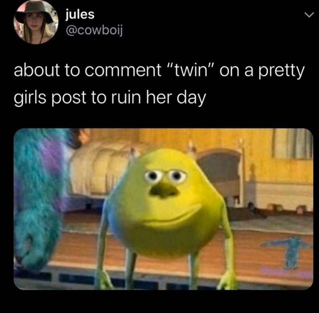

# boomer humour exhumer
A PyTorch Image classifier that detects boomer humour.

<p float="left" align="middle">
   
  
</p>
A boomer meme with it's distinctive art-style and anti-technology message on the left and a generic twitter meme on the right.


Achieves ~85% accuracy, and hyperparameters aren't optimised yet!

## Training Data

We scrape reddit using RedditDownloader https://github.com/shadowmoose/RedditDownloader 
to gather 11000 boomer-memes from the subreddits /r/Boomerhumour and /r/Boomershumor.

We scrape a similar number of non-boomer (general purpose) memes from /r/me_irl, /r/meirl, /r/WhitePeopleTwitter, /r/BlackPeopleTwitter, /r/196.

## Setup

### Install tesseract:

MacOS:
```
brew install tesseract
```

Ubuntu:
```
sudo apt-get install tesseract-ocr
```


### Optional: make a virtual environment and activate it:

```
python3 -m venv venv
source venv/bin/activate
```


### Install required python libraries from requirements.txt using pip:
```
pip3 install -r requirements.txt
```

## How to use
To determine the boomer energy of an image, navigate to /src/ and run:

```
python3 exhume.py /path/to/image
```

For example,

```
python3 exhume.py ../images/boomer.jpg
>>> The image is 87.48% Boomerish
```

or 

```
python3 exhume.py ../images/non_boomer.jpg
>>> The image is 1.61% Boomerish
```


## To Do

- [x] Single image exhumation
- [x] Exhumation as a microservice for querying
- [x] OCR Capability for reading text
- [x] Embeddings/RNN for encoding text into classification
- [x] Finish annotating all images 
- [ ] Add Dropout 
- [ ] Tune Hyperparameters 
- [ ] Filter false flag boomer memes
- [ ] Reddit bot that comments the boomerness of a post.
- [ ] Cloud Hosted

